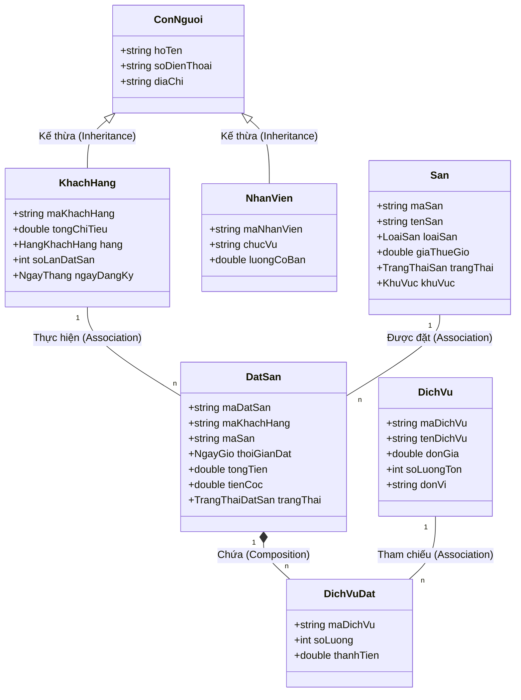

# 4.2. MỐI QUAN HỆ GIỮA CÁC LỚP (CLASS DIAGRAM)

Dưới đây là mã nguồn để tạo sơ đồ lớp chi tiết trên Draw.io, thể hiện đầy đủ các thuộc tính và mối quan hệ giữa các thực thể.

> **[HƯỚNG DẪN VẼ BIỂU ĐỒ]:**
> 1. Truy cập trang web [draw.io](https://app.diagrams.net/).
> 2. Chọn **Arrange** -> **Insert** -> **Advanced** -> **Mermaid**.
> 3. Sao chép và dán toàn bộ đoạn mã dưới đây vào khung nhập liệu rồi nhấn **Insert**.

### Phân tích chi tiết mối quan hệ và ràng buộc:

**1. Mối quan hệ giữa Khách Hàng và Đặt Sân (1 - n)**
*   **Thuộc tính liên kết:** `maKhachHang` là thuộc tính quan trọng dùng để định danh duy nhất mỗi khách hàng. Trong lớp `DatSan`, thuộc tính này đóng vai trò như một khóa ngoại tham chiếu đến đối tượng `KhachHang`.
*   **Ràng buộc:** Khi thực hiện một giao dịch đặt sân, hệ thống bắt buộc phải xác định được khách hàng nào đang thực hiện. Mã khách hàng trong đơn đặt sân phải tồn tại hợp lệ trong danh sách quản lý của lớp `KhachHang`.
*   **Ý nghĩa:** Một khách hàng có thể thực hiện nhiều lần đặt sân khác nhau (lịch sử giao dịch), nhưng mỗi đơn đặt sân chỉ thuộc về duy nhất một khách hàng. Sự liên kết này giúp hệ thống tính toán được `tongChiTieu` và cập nhật hạng thành viên cho khách hàng sau mỗi lần thanh toán.

**2. Mối quan hệ giữa Sân và Đặt Sân (1 - n)**
*   **Thuộc tính liên kết:** `maSan` dùng để phân biệt các sân bóng.
*   **Ràng buộc:**
    *   Khi tạo đơn `DatSan`, mã sân được chọn phải tồn tại trong hệ thống.
    *   **Ràng buộc trạng thái:** Sân được chọn phải có trạng thái là `HOAT_DONG`. Nếu sân đang `BAO_TRI` hoặc `NGUNG_HOAT_DONG`, hệ thống sẽ chặn không cho phép tạo liên kết với `DatSan`.
    *   **Ràng buộc thời gian:** Trong cùng một khung giờ (`thoiGianDat`), một sân chỉ có thể thuộc về một đơn `DatSan` duy nhất (trạng thái `DA_DAT`).
*   **Ý nghĩa:** Giúp quản lý lịch trình của sân, tránh việc trùng lịch (Double Booking).

**3. Mối quan hệ giữa Đặt Sân và Dịch Vụ (n - n)**
*   **Cơ chế giải quyết:** Mối quan hệ nhiều-nhiều này được giải quyết thông qua danh sách `DichVuDat` (thành phần con bên trong `DatSan`).
*   **Ràng buộc kho hàng:** Khi thêm một dịch vụ vào đơn đặt sân, hệ thống kiểm tra `soLuongTon` trong lớp `DichVu`. Số lượng khách đặt (`soLuong` trong `DichVuDat`) phải nhỏ hơn hoặc bằng số lượng tồn kho hiện có.
*   **Ý nghĩa:** Một đơn đặt sân có thể gọi nhiều loại dịch vụ khác nhau (nước, giày, áo...), và một loại dịch vụ có thể xuất hiện trong nhiều đơn đặt sân khác nhau.

**4. Mối quan hệ Kế thừa (Inheritance)**
*   Lớp `KhachHang` và `NhanVien` đều kế thừa từ lớp cha `ConNguoi`.
*   **Ý nghĩa:** Giúp tái sử dụng các thuộc tính chung như `hoTen`, `soDienThoai`, `diaChi` mà không cần khai báo lại, đảm bảo tính nhất quán trong cấu trúc dữ liệu người dùng của hệ thống.

Sự ràng buộc liên kết chặt chẽ giữa các thuộc tính quan trọng (như Mã Khách Hàng, Mã Sân, Mã Dịch Vụ) giúp hệ thống hoạt động chính xác, đảm bảo tính toàn vẹn dữ liệu (Data Integrity) và ngăn chặn các lỗi logic như đặt sân ảo, bán quá số lượng tồn kho hay tính sai điểm tích lũy.
